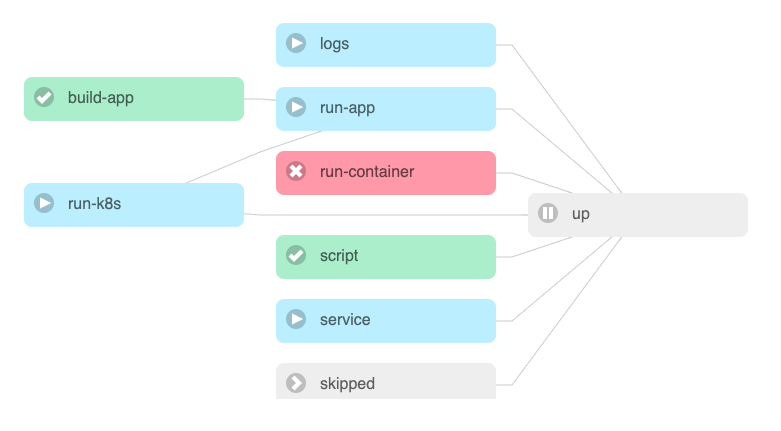

# Kit

[](https://github.com/kitproj/kit/actions/workflows/codeql-analysis.yml)
[](https://github.com/kitproj/kit/actions/workflows/go.yml)

Kit is a workflow engine for software development.

Kit combines task execution (like Makefile or Taskfile), service orchestration (like Foreman), container management (
like Docker Compose), Kubernetes resource
management (like Tilt, Skaffold), and a focus on local development (like Garden) in one binary.

For example, a `tasks.yaml` file can describe a Go project. It could start out by downloading a Helm chart, applying
that to a cluster and at the same time starting a local MySQL database, automatically starting port-forwards for both.
It could then generate some souce code, build the Go service, and
start the service. If a file changes, it could rebuild the project and restart the service. Meanwhile, it is
downloading, building and serving a Yarn project, configuring a Kubernetes cluster, and setting up secrets.

It's aimed at supporting more complex development use cases, where you need to run several software components at the
same time.



## Install

Like `jq`, `kit` is a small standalone binary. You can download it from
the [releases page](https://github.com/kitproj/kit/releases/latest).

## Usage

Workflows are described by a directed acyclic graph (DAG) of tasks.

Create a [`tasks.yaml`](tasks.yaml) file, e.g.:

```yaml
tasks:
  build:
    command: go build .
```

Start:

```bash
kit build
```

### Jobs vs Service

Every task is either a **job** or a **service**. A job is a task that runs once and exits, a service is a task that runs
indefinitely and listens on a port.

By default, a task is a job. To make a task a service, add a `ports` field:

```yaml
service:
  command: go run .
  ports: [ 8080 ]
```

The ports will be forwarded from the host to the service. A service will be restarted if it does not start-up (i.e. it
is listening on the port).

Kit will exit if:

- Any job fails.
- If you requested a specify job, and that completes successfully (e.g. test suite).
- You press `Ctrl+C`.

### Dependencies

Tasks can depend on other tasks:

```yaml
build:
  command: go build .
test:
  command: go test .
  dependencies: [ build ]
```

Tasks will only be started if the dependencies have completed successfully, or if the task is a service, it is running
and listening on its port.

### Tasks

#### Host Task

A **host task** runs on the host machine. It is defined by a `command`:

```yaml
build:
  command: go build .
```

Once a job completes successfully, its downstream task will be started. Once a service is listing on its port, its downstream task are started.

Unlike a plain task, if a service does not start-up (i.e. it is listening on the port), it will be restarted. You can
specify a probe to determine if the service is running correctly:

```yaml
service:
  command: go run .
  ports: [ 8080 ]
  readinessProbe:
    httpGet:
      path: /healthz 
```

Sometimes a task is a service, but you don't know what port it'll listen on. You can explicitly set the type as a
service:

```yaml
service:
  command: go run .
  type: Service  
```

Sometimes you just want a task to block indefinitely, often you'll have a task named `up` that does this:

```yaml
up:
  command: cat
```

#### Shell Task

A **shell task** is just a host task that runs in a shell:

```yaml
shell:
  sh: |
    set -eux
    echo "Hello, world!"
```

#### Container Task

A **container task** runs in a container. It is defined by an `image`:

```yaml
mysql:
  image: mysql
  ports: [ 3306:3306 ]
```

The ports will be forwarded from the host to the container.

If the image is a path to a directory containing Dockerfile, it will be built and run automatically:

```yaml
kafka:
  image: ./src/images/kafka
```

#### Kubernetes Task

A **Kubernetes task** deploys manifests to a Kubernetes cluster, it is defined by `manifests`:

```yaml
deploy:
  namespace: default
  manifests:
    - manifests/
    - service.yaml
  ports: [ 80:8080 ]
```

The ports will be forwarded from the Kubernetes cluster to the host.

#### No-op Task

A **no-op task** is a task that does nothing, depends on all other tasks:

```yaml
up:
  dependencies: [ deploy ]
```

No-op tasks are always succsessful.

### Environment Variables

A task can have **environment variables**:

```yaml
foo:
  command: go run .
  env:
    - FOO=1
  # environment variables from a file
  envfile: .env
```

### Watches

A task can be **automatically re-run** when a file changes:

```yaml
build:
  command: go build .
  watch: src/
```

### Targets

If a task produces an output, you can avoid repeating work by specifying the **task target**:

```yaml
build:
  command: go build .
  target: bin/app
```

The task will be skipped if the target is newer that the sources (just like Make).

### Mutexes and Semaphores

Use **mutexes** and **semaphores** to control concurrency:

If you want to prevent two tasks from running at the same time, use a mutex:

```yaml
tasks:
  foo:
    mutex: my-mutex
  bar:
    mutex: my-mutex
```

If you want to limit the number of tasks that can run at the same time, use a semaphore:

```yaml
# only two can run at the same time
semaphores:
  my-semaphore: 2
tasks:
  foo:
    semaphore: my-semaphore
  bar:
    semaphore: my-semaphore
```

### Logging

Sometimes a task logs too much, you can send logs to a file:

```yaml 
build:
  command: go build .
  log: logs/build.log
```

### Skipping Tasks

You can skip tasks by using the `-s` flag. This is useful if you want to run that task elsewhere (e.g. in IDE with
debugger connected to it):

```bash
kit -s foo,bar up
```

## Documentation

- [Examples](docs/examples) - examples of how to use kit, e.g. with MySQL, or Kafka
- [Reference](docs/reference) - reference documentation for the various types in kit

